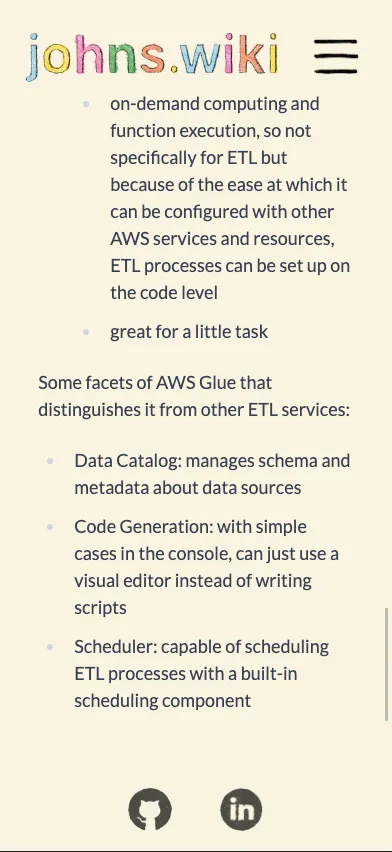

## The Problem

I was working on my Portfolio website when I noticed an issue with some of the pages. 

From a mobile screen size, if the text content of my page overflowed, the initial scroll position would be at the bottom of the page. Like this:



Everything else was looking and acting like I wanted it to. I did have particular demands for the scrolling behavior between mobile and desktop screen sizes, so I was unsure if I'd be able to get the behavior I wanted (page starts with the scroll position at the top) given my other requirements.

I had also just implemented Tailwind CSS styles throughout my code. I had actually spent a lot of time writing CSS rules, especially for my animations. However, I didn't really want to make my own Carousel component and I thought the Material/Tailwind Carousel component looked nice, so I added it and then said ah heck, why don't I try out Tailwind for the rest of the CSS. In the end, this wasn't a poor decision and I was able to get everything I wanted to work.

## The Solution

I had added some customizations to my Tailwind configuration to add some height styles. I wanted to set the height of elements relative to the view height so that my content and my fixed header and footer could coexist ☮️peacefully☮️. The element that contained my text content and an image on the page had my custom `h-75h` (`height: 75vh;`) Tailwind class on it, and when I removed it the page initialized with its scroll position at the top. However, this alone was not the sole source of the problem.

My page layout looks something like this:
```html
<BaseLayout>
	<main>
		<section>
			Text content here
		</section>
		<section>
			
		</section>
	</main>
</BaseLayout>
```

From a desktop screen size, the text renders on the left side of the page and the image renders on the right side. I decided that on a mobile screen size, I wanted the layout to adapt so that the image would render as a broad strip at the top with the scrollable text content underneath. To achieve this, I set `flex-direction: column-reverse;` on the `<main>` element. This [reverses the direction of the flex container's main axis](https://www.w3.org/TR/css-flexbox-1/#flex-direction-property). 

The unit used to define the height of this element (in confluence with my other CSS rules) affects where the page's initial scroll position is set. I'm not entirely sure why this happens yet. To solve my problem though, I needed to **remove the `height: 80vh;` rule from my element.**